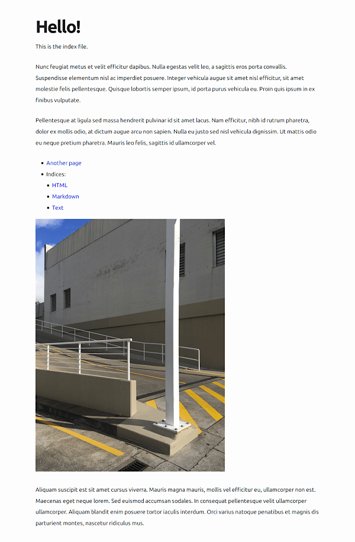

# caddy-markdown-site

This project allows you to serve Markdown files as adequately good-looking
minimal web pages with the [Caddy web server](https://caddyserver.com/).  It is
not a static site generator; there is no build step.  It consists of a
configuration file (Caddyfile) and some templates.  You will need some
knowledge of Caddy to use and customize it.

## Features

* If your file is `website/foo.md` and your domain example.com, you will be
able to access the file as both example.com/foo.md and example.com/foo with
no extension.
* `index.md` serves as a directory index (but `index.html` has priority).
* You can customize the look of your site without touching the main template.
Edit `website/templates/{head,header,footer}.html` to do it.  `head.html` links
the stylesheet.
* An error page is shown on error.

## Screenshot

## Requirements

* Caddy 2.3 or later.  Earlier 2.x versions may work but aren't tested.
* Optional:
    * [entr](https://github.com/eradman/entr) for development
      (`make dev`).
    * Optional: Tcl 8.6 or later and Tcllib to run the
      [tests](caddy-markdown-site.test) (`make test`).

## License

MIT.

[index.html](website/templates/index.html) derives from the
[index.html template](https://github.com/caddyserver/website/blob/1ff5103c73c921c8faa82ef3342d904a7f6a8e22/src/docs/index.html) used on the Caddy website.

[axist.min.css](website/media/axist.min.css) is
[axist](https://github.com/ruanmartinelli/axist), a
[classless](https://github.com/dbohdan/classless-css) CSS stylesheet.

[photo.jpg](website/media/photo.jpg) by Siarhei Plashchynski
[on Unsplash](https://unsplash.com/photos/6FmtLICCvxI).

> Unsplash grants you an irrevocable, nonexclusive, worldwide copyright license
> to download, copy, modify, distribute, perform, and use photos from Unsplash
> for free, including for commercial purposes, without permission from or
> attributing the photographer or Unsplash. This license does not include the
> right to compile photos from Unsplash to replicate a similar or competing
> service.
